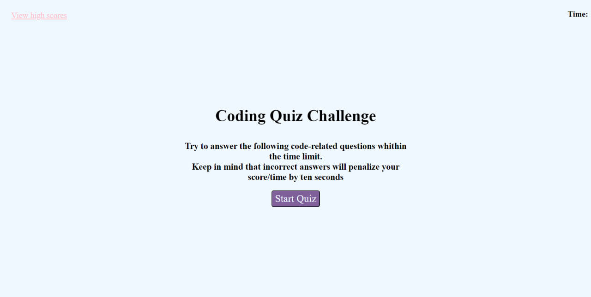
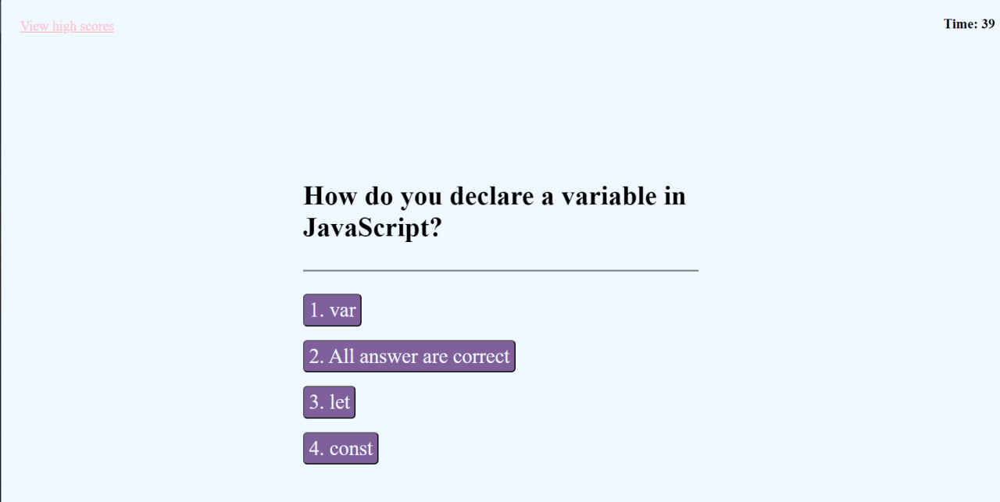
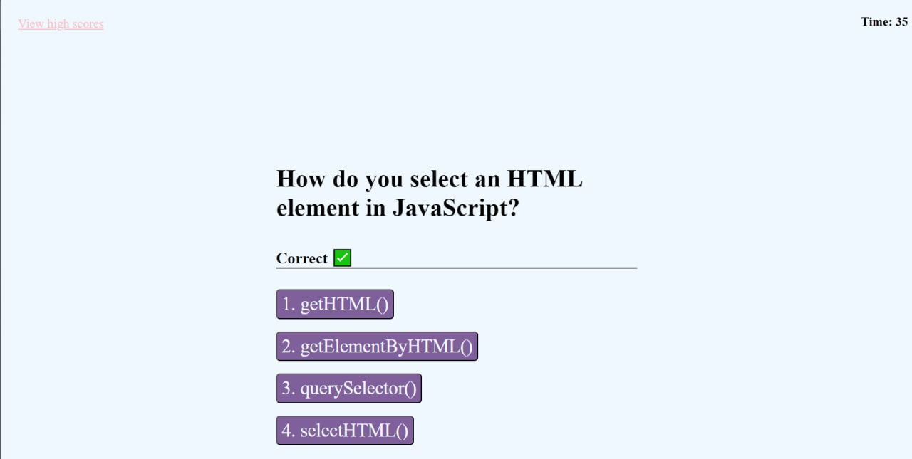
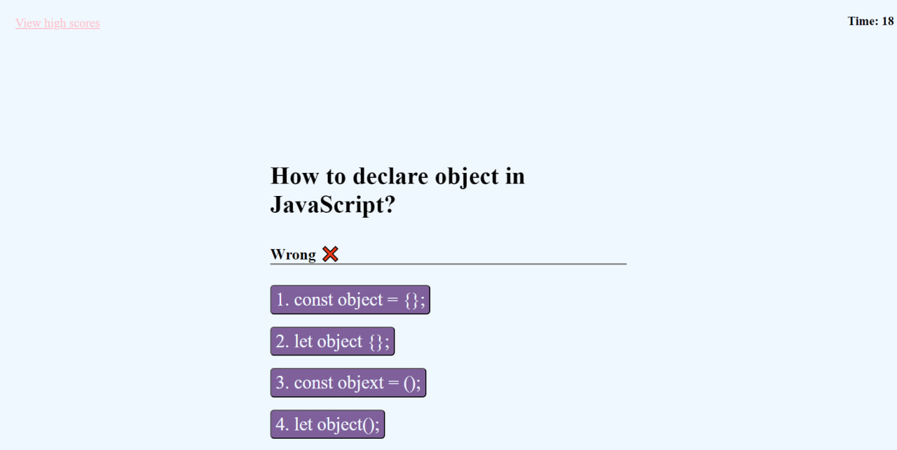
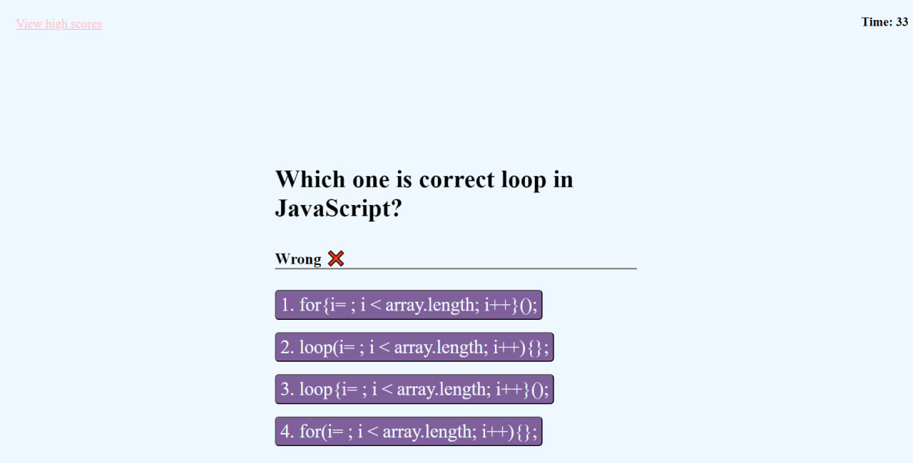
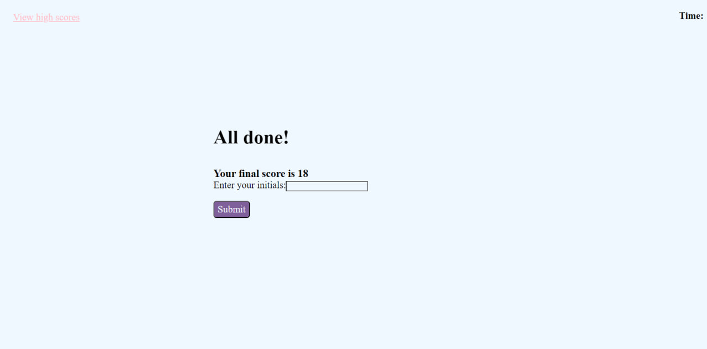
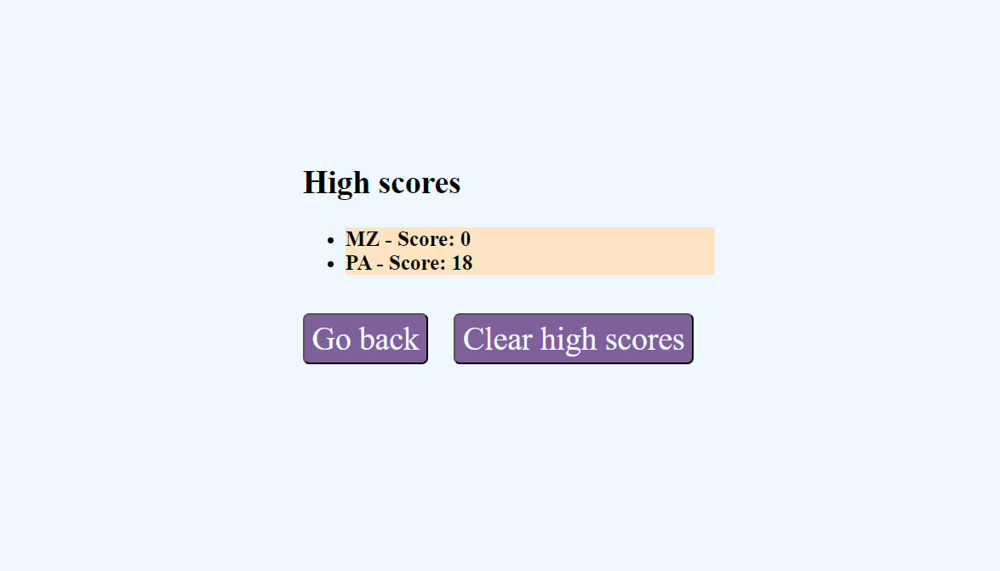

# Coding-Quiz-Game
Making coding quiz game 

## Description

I made web site with a game that have some questions about JavaScript. I wanted to make a game that starts from the button and then loop some questions. A timer should work during the game ,and if you choose some answer time is added or subtracted. After the game I want to add my initials to the form and save it with my score.

## Table of Contets

- [Screenshots](#screenshots)
- [Links](#links)

## Screenshots

In this section I provided screenshots of the Deployed Website Application.

## Links

In this section I added links to the deployed application and to the GitHub repositorie with the original codebase.

Deployed application
    https://mykhailozakh.github.io/Coding-Quiz-Game/

Project Repository
    https://github.com/MykhailoZakh/Coding-Quiz-Game